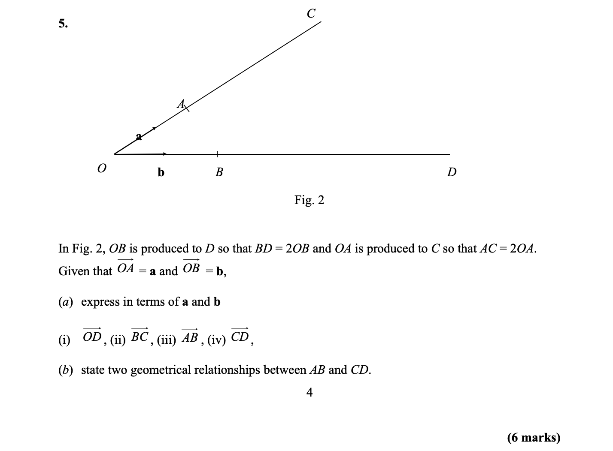

= Journey Into Space - 2020
Jez Higgins, jez@jezuk.co.uk
{docdate}
:customcss: style/theme-tweak.css
:revealjs_theme: white
:revealjs_progress: false

[background-iframe='pages/geepaw-hill-may-22.html']
== !
[NOTE.speaker]
--
// twirly
git checkout 6be5bffd98523667a3dcf75c04b7f42fe049cc1c

// moving and twirling
git checkout 7d347321a51d05428181bfb3fa831de9444020a7

// move on touch
git checkout 516348f6329d37f1adb9dda13328b7b31d7ae8a8

So few weeks ago, I saw this tweet and because I hadn't, as I've suggested, followed everything that Kent Beck, Ward Cunningham, and whomever had been up to, this was interesting news.
--

[background-iframe='https://ronjeffries.com/categories/asteroids/']
== !
[NOTE.speaker]
--
And here they are.
--

[background-iframe='pages/jez-may-31.html']
== !
[NOTE.speaker]
--
So it took me a couple of days but I went and read this articles. What Ron Jeffries is doing is writing a version of Asteroids for his iPad, using an environment called Codea. I hadn't heard of it before, I'm not Apple enabled, but it's a Lua based environment for games, simulations, and other graphical applications. It looks pretty cool. Ron describes what he's doing as he goes, and he's also trying to test drive as much as he can. Which, as says at the outset, is difficult for this kind of graphical application.

And it's just wonderful. There were 13 or 14 articles when I started reading. He's getting on to 60 little articles now, and they're just a joy. So much pleasure to be derived from them. So, I alerted my programmer friends on Twitter to them ...
--

[background-iframe='pages/jez-may-31-twirly.html']
== !
[NOTE.speaker]
--
... and then immediately afterwards, I did this.
--

[background-iframe='pages/jez-june-2.html']
== !
[NOTE.speaker]
--
A couple of days later, I had my little ship flying round the place.
--

[background-iframe='pages/jez-june-4.html']
== !
[NOTE.speaker]
--
Two days after that, it started to look like a game ...

I was trying to explain to my son Daniel how the old home computers made writing games easy - fixed sized screen you could just draw on, direct keyboard interrogation, all that was talking about back at the start of this talk, and that modern GUIs are antithetical to that.
--

[background-iframe='pages/jez-june-4.html']
== !
[NOTE.speaker]
--
Ok Jez, so what happened?
--

== !

[source,lua]
--
function drawShip()
    local sx = 10
    local sy = 6
    pushStyle()
    pushMatrix()
    translate(Ship.pos.x, Ship.pos.y)
    rotate(Ship.ang)
    strokeWidth(2)
    stroke(255)
    line(sx,0, -sx,sy)
    line(-sx,sy, -sx,-sy)
    line(-sx,-sy, sx,0)
    popMatrix()
    popStyle()
end
--
[NOTE.speaker]
--
It was this function, specifically the translate and rotate lines.

You know how, at the end of Murder, She Wrote or some similar light murder mystery somebody says something off-hand that triggers the detective to recollect some key detail? Suddenly all the pieces fall into place, like a jigsaw spontaneously assembling? Well this bit of code gave me that sensation. It was proper weird. All this stuff which I knew but hadn't joined up, wasn't even trying to join up, it was like the planets had instantaneously aligned and a solution I hadn't even been looking for was just beamed into my brain by a pink laser beam from space.
--

[background-iframe="https://www.cyclestreets.net/mobile/android/"]
== !

[NOTE.speaker]
--
CycleStreets for Android is something I've been working on for the past several years, on and off. It's a journey planner and satnav for, you'll be surprised to learn, cyclists. A few weeks ago, I was adding a new little feature - when you're in satnav mode, rotate the map to match the direction you're heading. You know the kind of thing.
--

== !
video::images/20200629-152314.mp4[options=autoplay]

[NOTE.speaker]
--
Most of what I wanted to do was actually provided by osmdroid, the mapping library, but the little bit I did was this compass. As the phone moves, I want the little north pointer to keep pointing north. The sensors on board - either the compass or the gps - give you the bearing, so you just need to rotate you're drawing the other way. Now that sounds like a pain in the arse, until you learn the drawing code will do it for you. All you have to do is locate you centre of rotation - there in the middle of the compass widget - and then say rotate that far - in degrees weirdly in whichever direction.

When I saw Ron Jeffries code - clearly the iOS surface has a similar API - I realised I could apply it  generally, not to entire controls. I wouldn't have to do the maths to turn the ship, or spin the asteroids, or anything else. The phone would do it for me. I got a new understanding of the graphics, and then boom, boom, boom, the rest just appeared.
--

== !
[source,kotlin]
--
val shape = floatArrayOf(
    -50f, 0f, 50f, 25f,
    50f, 25f, 50f, -25f,
    50f, -25f, -50f, 0f
)

fun draw(canvas: Canvas) {
    canvas.save()

    canvas.translate(canvas.width/2f, canvas.height/2f)
    canvas.rotate(angle)

    canvas.drawLines(shape, colour)

    canvas.restore()
}
--
[NOTE.speaker]
--
All modern GUIs are reactive. I say modern - all GUIs since about 1990 have been reactive. You get a message - key pressed, mouse click, window hidden, control needs redrawing - and then you get to do something.

As we saw back in 1982, games tend to be much more imperative. Update this position. Draw that thing.

The Codea environment Jeffries is using turns that kind of inside out. You get some reactive stuff - primarily the input messages, but mainly it's just calling your draw method in a pretty tight loop. I knew now that I could do that same. Create a single window that fills the display, fire up a thread and just spin it. I gave myself two methods - update and draw, but it's otherwise essentially the same.
--

== !

[source,kotlin]
--
while (running) {
    ...

    this.gameView.update(scaling)

    val canvas = this.surfaceHolder.lockHardwareCanvas()
    this.gameView.draw(canvas)
    surfaceHolder.unlockCanvasAndPost(canvas)

    ...
} // while ...
--

[NOTE.speaker]
--
This while loop is my 100 ... 200 GOTO 100 of 40 years ago.
--

== !

[NOTE.speaker]
--
Vector addition! You probably did some for your GCSE - that's O level for our older viewers. (All that rotation and translation stuff? That was in there too.) Getting the cool Asteroid movement is all about vectors.

If we rephrase this question as your ship is travelling along line OD. As it passes point B it is orientated toward point C. Describe the movement of the bullets.

Shall we jump across to AndroidStudio and look at the code?

* twirly
* twirl and move
* rotate on touch

* git log

* space men

As I've worked on this, and Ron's continued to work on what he's doing, sometimes I've run ahead of what he's doing, and sometimes he's run ahead of me and it's been interesting to see how our approaches have been similar or different.

Some of that has been partly driven by our implementation languages. Kotlin, which not as everything-must-be-a-class as Java, is pretty keen on types. Lua not so much. Perhaps as a consequence, I went to a common base class for all the bits flying around sooner than Jeffries. Kotlin's strong typing made that easier, despite my lack of tests. My preference is, generally, for little state machines or strategy patterns for behaviour over switches and indicator variables. But in other ways we're remarkably similar - the way we manage scoring is very similar, the collection of the things on the screen except for the ship which is special.
--

[background-iframe="pages/github.html"]
== !

[background-iframe="pages/google-play.html"]
== !
